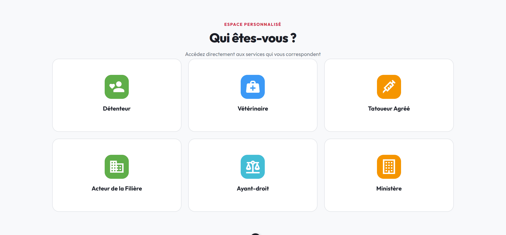
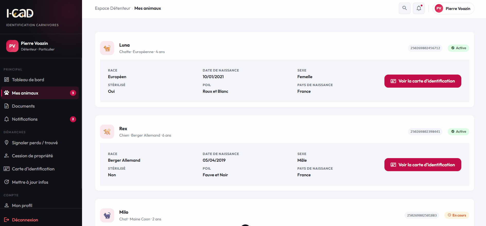
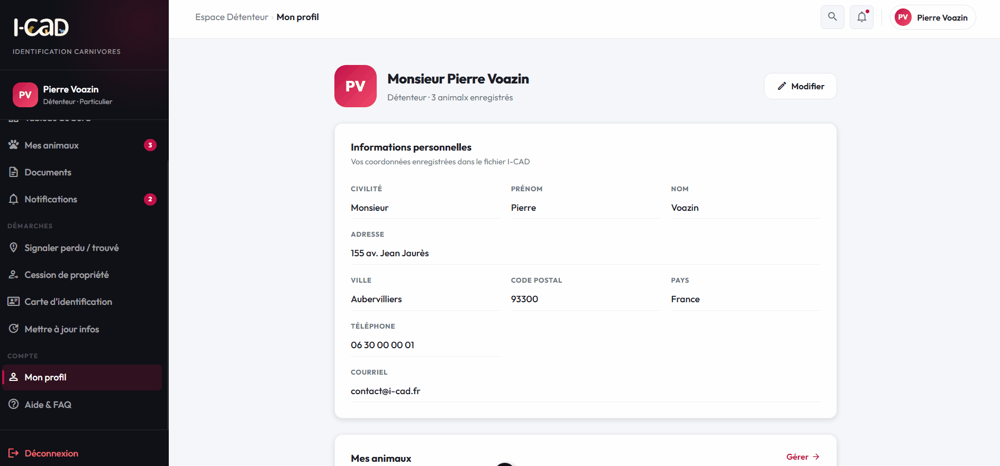

## Related

- 🖥️ Frontend: [icad-frontend-showcase](https://github.com/JosephAlonzo/icad-frontend-showcase)
- 🔧 Backend: [icad-backend-api-showcase](https://github.com/JosephAlonzo/icad-api-showcase)

# icad-frontend-showcase

Unofficial redesign &amp; frontend implementation of the I-CAD platform (French national pet identification system). Built with Vue 3 + TypeScript + Vuetify as a personal initiative to demonstrate motivation and technical skills. Not affiliated with I-CAD.

# 🐾 I-CAD — Frontend Redesign

> Personal project built as a proactive initiative to demonstrate frontend skills
> and genuine interest in joining the I-CAD team.
> Not requested, not affiliated — just motivated.

## Stack

- Vue 3 + TypeScript
- Vuetify 3
- Pinia
- Vue Router
- Vite

## What's inside

- Public landing page (hero, profiles, stats, news)
- Authenticated dashboard with sidebar layout
- Animal identification card (downloadable PDF)
- Détenteur profile page
- FAQ page
- Responsive design following I-CAD's visual identity

## Preview

### Landing Page


### Dashboard



### Carte d'identification



### My profile & FAQ



# icad-portfolio

This template should help get you started developing with Vue 3 in Vite.

## Recommended IDE Setup

[VS Code](https://code.visualstudio.com/) + [Vue (Official)](https://marketplace.visualstudio.com/items?itemName=Vue.volar) (and disable Vetur).

## Recommended Browser Setup

- Chromium-based browsers (Chrome, Edge, Brave, etc.):
  - [Vue.js devtools](https://chromewebstore.google.com/detail/vuejs-devtools/nhdogjmejiglipccpnnnanhbledajbpd)
  - [Turn on Custom Object Formatter in Chrome DevTools](http://bit.ly/object-formatters)
- Firefox:
  - [Vue.js devtools](https://addons.mozilla.org/en-US/firefox/addon/vue-js-devtools/)
  - [Turn on Custom Object Formatter in Firefox DevTools](https://fxdx.dev/firefox-devtools-custom-object-formatters/)

## Type Support for `.vue` Imports in TS

TypeScript cannot handle type information for `.vue` imports by default, so we replace the `tsc` CLI with `vue-tsc` for type checking. In editors, we need [Volar](https://marketplace.visualstudio.com/items?itemName=Vue.volar) to make the TypeScript language service aware of `.vue` types.

## Customize configuration

See [Vite Configuration Reference](https://vite.dev/config/).

## Project Setup

```sh
npm install
```

### Compile and Hot-Reload for Development

```sh
npm run dev
```

### Type-Check, Compile and Minify for Production

```sh
npm run build
```

### Run Unit Tests with [Vitest](https://vitest.dev/)

```sh
npm run test:unit
```

### Run End-to-End Tests with [Cypress](https://www.cypress.io/)

```sh
npm run test:e2e:dev
```

This runs the end-to-end tests against the Vite development server.
It is much faster than the production build.

But it's still recommended to test the production build with `test:e2e` before deploying (e.g. in CI environments):

```sh
npm run build
npm run test:e2e
```

### Lint with [ESLint](https://eslint.org/)

s

```sh
npm run lint
```
